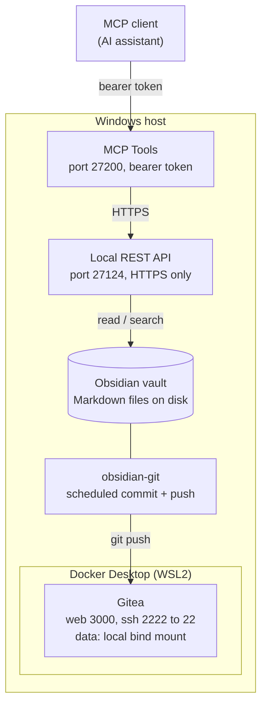

# NoBrainer

## Self-Hosted Obsidian Knowledge Stack

A private, version-controlled knowledge base that runs entirely on one machine: an Obsidian vault backed by a self-hosted Gitea server in Docker, with an MCP server exposing the vault to AI assistants.

No cloud git host. No third-party sync service holding the notes. Nothing leaves the machine unless you explicitly configure an external remote or service.

Now, I wanted to share y'all this because this stores important note taking and just here what I have to display as layout.

---

## Contents

- [Why?](#why)
- [Two repositories, on purpose](#two-repositories-on-purpose)
- [What is in this repo](#what-is-in-this-repo)
- [Architecture](#architecture)
- [Components](#components)
- [Setup](#setup)
- [Vault structure](#vault-structure)
- [Gotchas](#gotchas)

## Why?

Note vaults have three failure modes: they get disorganised until nothing is findable, they get lost, or they end up somewhere you would not want an employer's material to be. This stack addresses all three: structure and conventions for the first, git history for the second, self-hosting for the third.

The MCP layer is the part that makes it more than a folder of markdown: an AI assistant can read and search the vault directly, so the notes become queryable rather than just stored.

## Two repositories, on purpose

This stack uses two repos with different jobs, and the split is the important design decision, not an afterthought.

|               | Remote            | Visibility | Holds                                          |
| ------------- | ----------------- | ---------- | ---------------------------------------------- |
| **The vault** | Self-hosted Gitea | Private    | Actual notes                                   |
| **This repo** | GitHub            | Public     | The system: setup, schema, templates, gotchas  |

The reason is simple. A knowledge vault covering coursework, internships, and project work is exactly the material that should not be on a public host. Internship notes in particular are written to capture internal tooling and architecture, which is the thing employers expect you to keep private. Git makes that permanent: a public commit is scraped and mirrored within minutes, and deleting it afterwards does not recall the copies.

But none of that material is what makes the setup worth showing. The system is: the self-hosted remote, the MCP layer, the property schema, the failure modes below. So the vault stays private on Gitea, and everything reproducible lives here, publicly, with no note bodies in it.

If you want an off-machine backup of the vault as well, add a private GitHub repo as a second push URL and push to both:

```bash
git remote set-url --add --push origin http://localhost:3000/<user>/<repo>.git
git remote set-url --add --push origin git@github.com:<user>/<private-repo>.git
git push origin <branch>   # goes to both
```

## What is in this repo

```text
.
|-- README.md                  this file
|-- docker-compose.yml         the Gitea service
`-- vault-template/
    |-- Vault Conventions.md   the property and tag schema
    |-- vault.gitignore        rename to .gitignore in your vault
    |-- vault.gitattributes    rename to .gitattributes in your vault
    |-- templates/             7 note templates
    `-- dashboards/            the two Bases dashboards
```

Copy `vault-template/` into a fresh vault, rename the two dotfiles, and you have the structure with none of anyone's notes.

## Architecture

The request path runs top to bottom: an AI assistant talks to the MCP server, which reads the vault through the REST API, and obsidian-git pushes the same files to Gitea on a timer.



<details>
<summary>Plain-text version (for viewers that don't render Mermaid)</summary>

```text
MCP client (AI assistant)
        |
        |  bearer token
        v
+--- Windows host ------------------------------------+
|                                                     |
|  MCP Tools                                          |
|  port 27200, bearer token                           |
|        |                                            |
|        |  HTTPS                                     |
|        v                                            |
|  Local REST API                                     |
|  port 27124, HTTPS only                             |
|        |                                            |
|        |  read / search                             |
|        v                                            |
|  Obsidian vault  (Markdown files on disk)           |
|        |                                            |
|        |  same files                                |
|        v                                            |
|  obsidian-git                                       |
|  scheduled commit + push                            |
|        |                                            |
|        |  git push                                  |
|        v                                            |
|  +--- Docker Desktop (WSL2) ------------------+     |
|  |                                            |     |
|  |  Gitea                                     |     |
|  |  web 3000, ssh 2222 -> 22                  |     |
|  |  data: local bind mount                    |     |
|  |                                            |     |
|  +--------------------------------------------+     |
|                                                     |
+-----------------------------------------------------+
```

</details>

## Components

| Component      | Version                  | Role                                          | Port                           |
| -------------- | ------------------------ | --------------------------------------------- | ------------------------------ |
| Obsidian       | 1.13.7                   | Editor; Bases and Graph are core plugins      | -                              |
| Gitea          | 1.22 (Docker)            | Private git remote                            | 3000 (web), 2222 -> 22 (ssh)   |
| Docker Desktop | 4.43.1 / engine 28.3.0   | WSL2 backend                                  | -                              |
| obsidian-git   | plugin                   | Scheduled auto-commit and push                | -                              |
| MCP Tools      | plugin                   | MCP server over the vault, bearer-token auth  | 27200                          |
| Local REST API | plugin                   | HTTPS API the MCP layer sits on               | 27124                          |

> [!NOTE]
> HTTP on the Local REST API (27123) is disabled. HTTPS only, with a self-signed cert generated by the plugin.

## Setup

### 1. Gitea

`docker-compose.yml`:

```yaml
networks:
  gitea:
    external: false

services:
  server:
    image: gitea/gitea:1.22
    container_name: gitea
    environment:
      - USER_UID=1000
      - USER_GID=1000
      - GITEA__server__DOMAIN=localhost
      - GITEA__server__SSH_DOMAIN=localhost
      - GITEA__server__ROOT_URL=http://localhost:3000/
    restart: always
    networks:
      - gitea
    volumes:
      - ./gitea-data:/data
      - /etc/timezone:/etc/timezone:ro
      - /etc/localtime:/etc/localtime:ro
    ports:
      - "3000:3000"
      - "2222:22"
```

```bash
docker compose up -d
```

Then open <http://localhost:3000>, complete the install wizard, create the user, and create the repo as **private**.

> [!WARNING]
> Put this directory outside any cloud-synced folder. See [Gotcha 3](#3-do-not-put-gitea-data-in-a-cloud-synced-folder).

### 2. Vault as repo

The vault root and the git repo root must be the **same directory**:

```text
my-vault/          <- vault root AND git repo root
|-- .git/
|-- .obsidian/
|-- .gitignore
|-- Home.md
`-- ...
```

```bash
cd /path/to/my-vault
git init
git remote add origin http://localhost:3000/<user>/<repo>.git
```

### 3. `.gitignore`

Non-negotiable. Plugin settings files contain credentials:

```gitignore
# Machine-specific UI state, churns constantly
.obsidian/workspace.json
.obsidian/workspace-mobile.json

# Plugin settings can contain API keys and private keys
.obsidian/plugins/*/data.json

# Plugin bundles: large, and reinstallable from the community browser
.obsidian/plugins/*/main.js
.obsidian/plugins/*/styles.css
.obsidian/plugins/*/*.map

.obsidian/cache
.trash/
Thumbs.db
Desktop.ini
.DS_Store
```

And `.gitattributes`, or git warns about line endings on every file:

```gitattributes
* text=auto eol=lf
*.png binary
*.jpg binary
*.pdf binary
```

### 4. obsidian-git

Install from Community Plugins, then set a backup interval. It commits and pushes on a timer; with the vault root as repo root, it picks up every note.

### 5. MCP layer

Two plugins, stacked:

- **Local REST API** exposes the vault over HTTPS on `27124` with a generated API key and self-signed cert. Leave the insecure HTTP port off.
- **MCP Tools** runs the MCP server on `27200`, bearer-token authenticated, with semantic search and live indexing over the vault.

Point the MCP client at `http://localhost:27200` with the bearer token from the plugin's settings panel. The plugin can write a client config for you, or you can do it by hand.

> [!IMPORTANT]
> Rotate both credentials if they were ever committed. Regenerating in the plugin settings invalidates the old value immediately, which is the actual fix. Scrubbing git history is optional once the key is dead.

## Vault structure

Folders are numbered because Obsidian's file explorer sorts alphabetically and offers no manual ordering, so the prefix is the ordering mechanism. Three bands, grouped by how often you touch them:

```text
# Pass-through
00-Inbox/          unsorted captures
01-MOCs/           navigation layer
05-Daily/          daily notes, excluded from dashboards

# Content (spaced 10 apart so new sections slot in without renumbering)
10-Classwork/
20-Competitions/
30-Internships/
40-Projects/
50-Reference/

# Plumbing (pinned to the bottom)
90-Assets/
95-Templates/
99-Archive/
```

The gap between `50` and `90` is runway for future content sections.

### Maps of Content

A MOC is a note whose only job is linking other notes. A note lives in one folder but can be linked from any number of MOCs: folders answer *where is it filed*, MOCs answer *what does this connect to*. One MOC per section, all reachable from a `Home` note.

The single rule that keeps it working: **every new note gets linked from a MOC before you close it.** An unlinked note is one you will never find again.

### Property schema

Every note carries the same baseline frontmatter. Consistency is not cosmetic: Bases queries and any AI reading the vault both break when property names drift.

```yaml
---
title: Note Title
aliases: []
type: course | competition | internship | project | reference | moc | daily
status: idea | active | paused | complete | reference
tags: [ctx/project, kind/notes]
created: 2026-09-15
updated: 2026-09-15
summary: One line. This is what makes a large vault scannable.
related: ["[[Other Note]]"]
---
```

`status` means progress and nothing else. There is deliberately no second "note maturity" axis, because two properties that both sound like status is how schemas rot.

Tags come from a controlled vocabulary (`ctx/` context, `kind/` form, `sec/` domain) documented in the vault itself. Add to the list before using a new one.

### Dashboards

Built with **Bases**, Obsidian's native database views (core since 1.9), not Dataview. Bases tables are editable (changing a `status` cell rewrites that note's frontmatter) and hold up better on large vaults.

### Note naming

Filenames are Title Case. Never use `#` `|` `^` `:` `%` `[` `]` because they have meaning inside `[[wikilinks]]`. Rename notes inside Obsidian so backlinks update; a shell `mv` silently breaks every inbound link.

## Gotchas

Everything here was hit in practice.

### 1. Vault root must equal repo root

With the vault nested one level inside the repo, obsidian-git finds `.git` but commits only what is at the repo root: config files, no notes. Backups appear to be running and are capturing nothing. Check an actual commit's file list, not just that commits exist.

### 2. Plugin `data.json` files contain credentials

Local REST API stores its API key, cert, and private key there. MCP Tools stores its bearer token. Both are inside `.obsidian/`, which people commit wholesale. Gitignore them from the first commit; if you did not, rotate the keys rather than rewriting history.

### 3. Do not put `gitea-data` in a cloud-synced folder

Gitea keeps a SQLite database in there. Cloud clients sync files mid-write, and a half-synced database is a corrupt database. Keep the whole Gitea directory on local disk.

### 4. Moving the Gitea directory requires recreating the container

Docker stores the resolved absolute bind-mount path in the container config, so a moved directory does not follow. Worse, `restart: always` plus Docker's habit of auto-creating missing bind sources means the old container comes back pointing at a freshly created empty directory and runs the install wizard as if the data were gone. Stop and remove the container first:

```bash
docker rm -f gitea
cd /new/path && docker compose up -d
docker inspect gitea --format '{{range .Mounts}}{{.Source}} -> {{.Destination}}{{end}}'
```

### 5. `unable to get 'ProgramData'` on Docker Desktop startup

Docker Desktop reads `%ProgramData%` from its environment and dies immediately if it is unset. Launching it from a shell with a sanitised environment reproduces this every time. It is not a broken install: launch from the Start menu, or set the variable first.

### 6. Stale AF_UNIX sockets block startup after an unclean shutdown

Symptom in `%LOCALAPPDATA%\Docker\log\host\monitor.log`:

```text
initializing Inference manager: listening on unix://...\Docker\run\dockerInference:
remove ...\Docker\run\dockerInference: The file cannot be accessed by the system
```

Those files are reparse points that Windows will not delete; `Remove-Item`, `del`, and `fsutil` all fail. Rename the parent directory instead, and Docker recreates it on next launch:

```powershell
Rename-Item "$env:LOCALAPPDATA\Docker\run" "run-broken"
```

### 7. Gitea returns 404, not 403, for private repos

Browsing the repo URL while signed out looks like the repo is missing. It is working as intended.
